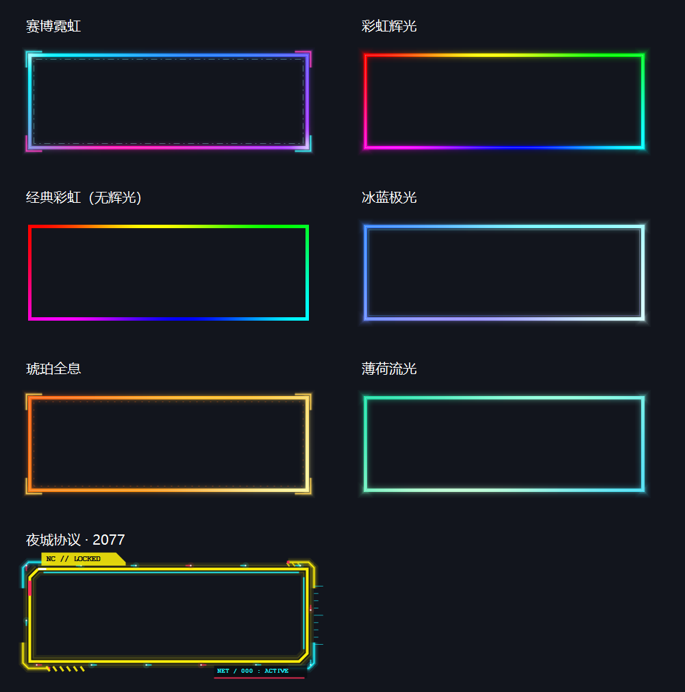
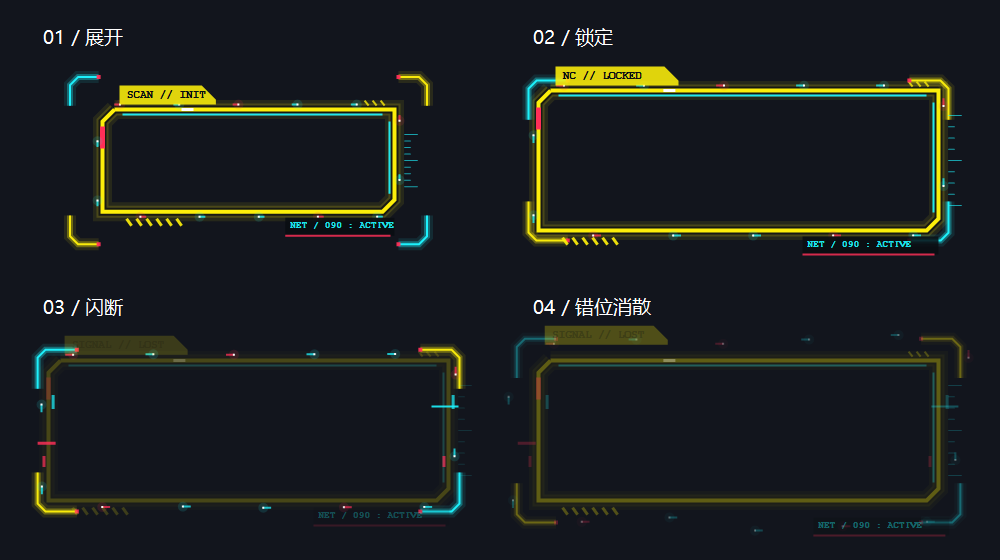

# QuickFrame

**右键拖动，随手框重点。** Windows 屏幕标注小工具，支持霓虹边框、框外渐暗和自动消散，仅在系统托盘运行。

A small Windows tray utility for temporary screen highlights: right-drag to draw, release to fade. Includes animated borders, an optional focus mask, and saved preferences.

[下载 Windows 版本](https://github.com/shenidme/QuickFrame/releases/latest) · [使用说明](docs/usage.zh-CN.md) · [报告问题](https://github.com/shenidme/QuickFrame/issues)



## 使用

1. 从 Releases 下载 `QuickFrame-windows.zip`，解压到可写目录，运行 `QuickFrame.exe`。
2. **按住右键拖动**画框；移动达到 8 像素时触发。按住不动，框也会一直保留。
3. **松开后**默认停留 1.5 秒，再用 0.5 秒消散。菜单支持“无停留”，松开即开始消散。
4. 右键点击托盘图标，选择预设、停留时间、聚焦遮罩、暂停或退出。

**Ctrl + Alt + F8** 或双击托盘图标：暂停 / 恢复。托盘图标可能位于任务栏的隐藏图标区域。

## 功能

- 7 种风格：赛博霓虹、彩虹辉光、经典彩虹、冰蓝极光、琥珀全息、薄荷流光、夜城协议；另有 5 种纯色辉光。
- 夜城协议包含展开锁定、分段装甲、边缘光点和故障消散效果。所有图形由代码绘制。
- 聚焦遮罩让框内保持正常、框外平滑变暗；多个框都可以保持明亮。
- 鼠标监听运行在独立线程，提供重新连接和手动修复入口。
- 外观、停留时间、遮罩和暂停状态保存到程序旁的 `settings.ini`，下次启动恢复。
- 无安装器、无自动启动、无网络请求或遥测。



## 环境和已知限制

- Windows 10/11，.NET Framework 4.x（建议使用系统随附的 4.8 或更新版本）。
- 开启时，**右键拖动用于画框**。需要应用原有右键拖动、鼠标手势或游戏操作时，请先暂停。
- 普通右键单击在松开时回放，因此部分软件的按住右键行为可能不同。
- 管理员窗口、游戏、远程桌面及多屏混合 DPI 兼容性仍需进一步测试。
- 框固定在屏幕坐标，不跟随网页或窗口内容滚动。夜城预设的扫描标签仅是视觉装饰。
- EXE 未签名；发布页面同时提供 SHA-256 校验文件。

## 从源码构建

无需 NuGet 包或额外 SDK，构建脚本使用 Windows .NET Framework 自带的 C# 编译器。

```powershell
git clone https://github.com/shenidme/QuickFrame.git
cd QuickFrame
./build.ps1 -Test -Package
```

输出：`bin/QuickFrame.exe`、`dist/QuickFrame-windows.zip`。

可选桌面环境检查：

```powershell
./build.ps1 -InteractiveTests
```

交互测试会短暂显示示例框和遮罩，验证监听线程及长按状态机，不注入鼠标点击。请先退出正在同一桌面运行的 QuickFrame，避免单实例保护跳过测试。

CI 运行手势、绘制透明度、渐隐时间和设置持久化测试。桌面交互检查需在 Windows 桌面环境运行，不能替代实际鼠标、多显示器和特定应用的兼容性验证。

## 项目结构

```text
src/QuickFrame.cs       输入监听、动画渲染、托盘菜单和配置
build.ps1              构建、测试和便携包
docs/                  使用说明与效果预览
.github/workflows/     Windows CI
```

欢迎通过 Issue 反馈 Windows 版本、显示器缩放、使用的预设、触发步骤和预期行为，也欢迎提交改进。

## License

[MIT](LICENSE). Copyright © 2026 shenidme.
